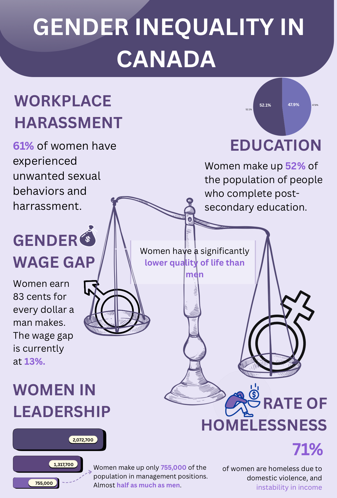

# 👥 Gender Inequality in Canada — A Visual Breakdown

This infographic highlights key areas where women in Canada continue to face systemic inequality.  
Rather than presenting these issues as isolated statistics, this visual brings them together to show the **collective weight of inequality** and how it shapes women’s everyday lives — in workplaces, education, leadership, economics, and safety.

Created in Canva, the design uses soft but intentional tones, iconography, and proportional visuals to make the data clear, accessible, and grounded in real-world impact.

---

## 🎯 Purpose of the Visualization

The goal of this infographic is to:

- Present the realities of gender inequality in a **clear, digestible way**  
- Show how different forms of inequality are **interconnected**  
- Use visual communication to highlight issues often lost in long reports  
- Encourage empathy and awareness, not just information consumption  

While these numbers are data points, they represent lived experiences — experiences shaped by unfair pay, harassment, limited opportunities, and the social consequences that follow.

---

## 📊 Key Insights Highlighted

- **61%** of women have faced unwanted sexual behaviors or harassment in the workplace  
- Women earn **83 cents** for every dollar earned by men  
- Women make up **52%** of post-secondary graduates, yet remain underrepresented in leadership  
- Only **755,000 women** nationwide occupy management roles  
- **71%** of women experiencing homelessness cite violence, instability, or financial insecurity  

Each statistic is paired with visual cues to emphasize scale, imbalance, and emotional reality.

---

## 🎨 Tools & Techniques

- Canva  
- Infographic design  
- Visual hierarchy  
- Color psychology  
- Proportion and scale  
- Communicating sensitive data with clarity and respect  

---

## 💬 Designer’s Reflection

This infographic was created with intention.  
Gender inequality is often discussed in fragments — a statistic here, a report there — but rarely shown as a **connected ecosystem of disadvantages**.

Designing this piece reinforced the importance of presenting sensitive topics in a way that is honest, grounding, and respectful.  
The goal isn’t to overwhelm the viewer, but to make the truth harder to overlook.

---

## 📸 Infographic Preview

