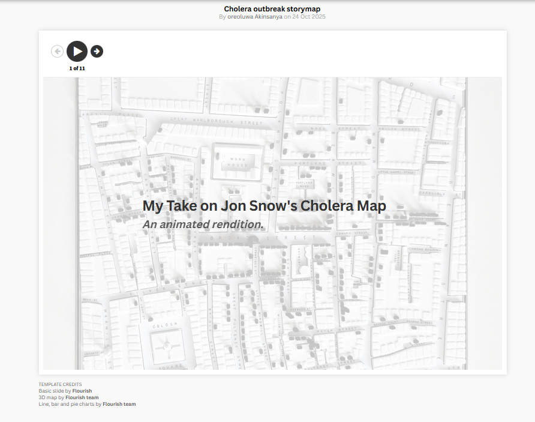

# 🗺️ John Snow Cholera Map — Modern Scrollytelling Redesign  
*A Flourish-based reinterpretation of one of history’s most influential public-health visualizations.*

---

## 📌 Project Overview  

This project is a modern, interactive redesign of **John Snow’s 1854 cholera outbreak map**, recreated as a **Flourish scrollytelling experience**.  

The goal was not only to visualize the outbreak, but to **re-tell the story** of how cholera spread through Soho, how patterns emerged, and how Snow’s insight ultimately reshaped public health.

By combining an animated map, narrative text, and temporal sequencing, this redesign brings new clarity to the original dataset — showing how deaths clustered around the Broad Street pump and how the outbreak evolved over time.

---

## 🎯 Purpose & Approach  

### ✔ Historical Perspective  
John Snow’s original cholera map is one of the earliest and most significant examples of spatial epidemiology. This project preserves the core logic of his work while adapting it into a format that modern viewers can explore interactively.

### ✔ Analytical Foundation  
The project is built from the historical death-record dataset, cleaned and structured into a usable form for animated mapping.  
The dataset includes:  
- Household-level death counts  
- Geographic coordinates  
- Dates of death  

This identical structure allowed Flourish to animate both **location** and **time progression** of the outbreak.

### ✔ Design & Storytelling  

This redesign intentionally expands on what the original 1854 map could not show.  
Beyond recreating Snow’s visualization, the aim was to:

- provide a **clear comparative view of the outbreak before and after the Broad Street pump handle was removed**,  
- visualize how death patterns changed following this intervention,  
- incorporate a **day-by-day timeline** to reveal how fast the outbreak spread,  
- modernize the aesthetic, colors, and clarity while maintaining historical integrity.

Where Snow’s original map was static, this project uses animation and guided narrative to deepen understanding — allowing viewers to see not just *where* deaths occurred, but *when* and *how the outbreak shifted* after public-health action was taken.

---

## 🌐 View the Interactive Story  

Click below to explore the full animated visualization:

👉 **[https://public.flourish.studio/story/3396580/](https://public.flourish.studio/story/3396580/)**

---

## 🧠 Skills & Techniques Demonstrated  

- Data cleaning & structuring of historical public-health data  
- Temporal and spatial reasoning  
- Interactive map design using Flourish  
- Narrative sequencing / scrollytelling  
- Ethical presentation of mortality data  
- Historical interpretation and modern redesign  

---

## 💬 Reflection  

Redesigning John Snow’s cholera map emphasized how timeless his insight was.  
Even without modern tools, Snow used spatial patterns to uncover the source of the epidemic — a method that continues to influence epidemiology today.  

Bringing this into an interactive, animated format allowed me to:  
- deepen my understanding of the outbreak,  
- explore how visualization shapes reasoning,  
- and communicate a 170-year-old event through a modern storytelling lens.

This project strengthened my skills in **data visualization, historical interpretation, and narrative-driven communication**, showing that design and analysis are most impactful when they work together.

---

